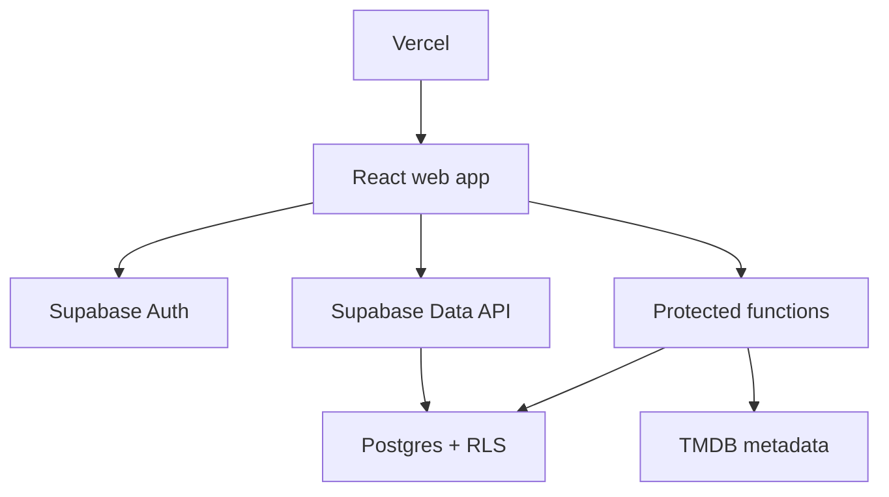

# MCU Doomsday Watch Group — Incremental Build Plan

## 1. Product definition

### Working concept

A private, invite-based MCU watch-group app that helps friends work through a curated Marvel watchlist before _Avengers: Doomsday_. It combines the progress and countdown ideas of a watch-order guide with the social structure of a fantasy league.

One user creates a group and becomes its owner. They share an invite link or code. Members join the group, track their own progress, see what everyone is currently watching, rate each title out of 10, and publish reviews visible to group members.

### MVP product promise

> Create a private MCU watch group, invite friends, follow a shared watch order, and compare everyone’s progress and opinions on the road to Doomsday.

### MVP boundaries

Build these:

- Email authentication.
- Create, join, leave, and view a private group.
- Owner-generated invite links/codes with expiry and usage controls.
- One curated MCU catalog and default watch order.
- Group-selected current title.
- Per-member status: `not_started`, `watching`, or `watched`.
- Per-member rating from 1.0–10.0 and one editable review per title.
- Group dashboard, title detail, members, and settings pages.
- Countdown with an admin-configurable Doomsday release date.
- Responsive desktop and mobile UI.

Do not build in the first release:

- Public groups or discovery.
- Chat, comments on reviews, reactions, or notifications.
- Multiple custom watchlists per group.
- Complex calendar scheduling.
- Streaming playback.
- Native mobile apps.
- Global public reviews.
- Automatic scraping of the reference website.

## 2. Recommended technical architecture

### Stack

| Area           | Choice                                      | Reason                                                                               |
| -------------- | ------------------------------------------- | ------------------------------------------------------------------------------------ |
| Frontend       | React + TypeScript + Vite                   | Matches the requested stack and deploys cleanly to Vercel.                           |
| Routing        | React Router                                | Clear protected and public route structure.                                          |
| Styling        | Tailwind CSS                                | Fast, consistent responsive implementation.                                          |
| Components     | shadcn/ui primitives + Radix                | Accessible primitives without locking the visual identity.                           |
| Remote state   | TanStack Query                              | Caching, invalidation, mutations, and optimistic UI.                                 |
| Forms          | React Hook Form + Zod                       | Typed validation shared across forms.                                                |
| Backend        | Supabase                                    | Postgres, Auth, Realtime, database functions, and Row Level Security in one service. |
| Catalog source | Curated local seed using TMDB IDs           | Stable editorial watch order with updateable artwork and metadata.                   |
| Tests          | Vitest + React Testing Library + Playwright | Unit/component coverage plus critical user-flow tests.                               |
| Hosting        | Vercel                                      | Preview deployments and production hosting for the Vite SPA.                         |
| CI             | GitHub Actions                              | Type-check, lint, test, and build on pull requests.                                  |

Use Supabase directly from the browser only for operations protected by Row Level Security. Put privileged actions—such as invite redemption, ownership transfer, and catalog synchronization—behind carefully defined Postgres functions or server-side functions. Never expose a Supabase secret/service-role key or a TMDB API token in the client bundle.

### High-level system



### Important architectural rule

Group membership is the authorization boundary. A signed-in user must not be able to read or mutate any group-owned row unless they have an active membership in that group. Hiding buttons in React is not authorization; database policies must enforce it.

## 3. Product roles and permissions

| Capability                     | Visitor |     Member |      Owner |
| ------------------------------ | ------: | ---------: | ---------: |
| View landing/catalog preview   |     Yes |        Yes |        Yes |
| Create a group                 |      No |        Yes |        Yes |
| View group data                |      No | Own groups | Own groups |
| Update own watch status        |      No |        Yes |        Yes |
| Add/edit own rating and review |      No |        Yes |        Yes |
| Change group’s current title   |      No |         No |        Yes |
| Generate/revoke invites        |      No |         No |        Yes |
| Remove members                 |      No |         No |        Yes |
| Transfer ownership             |      No |         No |        Yes |
| Delete group                   |      No |         No |        Yes |

For the MVP, a user may belong to multiple groups, but each group has exactly one owner.

## 4. Core user flows

### New owner

1. Visit landing page.
2. Sign up or sign in.
3. Choose **Create a watch group**.
4. Enter group name and optional description.
5. Land on the empty-state group dashboard.
6. Generate an invite link.
7. Select the group’s current title.

### Invited member

1. Open `/invite/:token`.
2. See group name, owner, member count, and invite validity—but no private reviews.
3. Sign up/sign in if needed.
4. Confirm joining.
5. Land on the group dashboard.

### Watching and reviewing

1. Open current title or another title in the watchlist.
2. Set status to `watching` or `watched`.
3. After watching, choose a rating from 1–10, optionally in 0.5 increments.
4. Write or edit a review.
5. See the group average and other members’ reviews.

## 5. Information architecture and routes

| Route                              | Access        | Purpose                                                      |
| ---------------------------------- | ------------- | ------------------------------------------------------------ |
| `/`                                | Public        | Marketing page, countdown, product explanation, sign-in CTA. |
| `/auth`                            | Public        | Sign up, sign in, reset password.                            |
| `/invite/:token`                   | Public shell  | Validate invite and guide authentication/join flow.          |
| `/app`                             | Authenticated | Group picker and create/join actions.                        |
| `/groups/:groupId`                 | Group member  | Dashboard: current title, progress, activity, standings.     |
| `/groups/:groupId/watchlist`       | Group member  | Full ordered catalog with filters and member progress.       |
| `/groups/:groupId/titles/:titleId` | Group member  | Title metadata, status, rating, review, group reviews.       |
| `/groups/:groupId/members`         | Group member  | Member progress and comparison.                              |
| `/groups/:groupId/settings`        | Owner         | Group settings, current title, invites, member management.   |
| `/profile`                         | Authenticated | Display name, avatar, and account preferences.               |
| `/about`                           | Public        | Fan-project disclaimer, TMDB credit, privacy information.    |

## 6. Page requirements

### Landing page

- Dark cinematic hero with an original geometric/space motif.
- Product name, one-sentence value proposition, and Doomsday countdown.
- Primary CTA: **Create your watch group**.
- Secondary CTA: **Join with an invite**.
- Small preview of the shared dashboard and watchlist.
- Explanation in three steps: create, invite, watch together.
- Unofficial fan-project disclaimer and data attribution in the footer.

### Group dashboard

- Group selector and group name.
- Countdown to configurable target date.
- Current title hero card: poster, title, type, runtime, synopsis, watch-order position.
- Owner-only **Change current title** action.
- Group metrics: titles completed as a group, average completion, current-title completion, total reviews.
- Member progress cards with avatar, watched count, percentage, and current status.
- Recent activity feed: joined, started, completed, rated, or reviewed.
- Upcoming three titles.

Define **completed as a group** as every active member having status `watched`. Define **average completion** as the average of each active member’s watched-title percentage. Show tooltips so these metrics are not ambiguous.

### Watchlist

- Toggle between release order and curated Doomsday order if both are seeded; otherwise show curated order only in MVP.
- Search by title.
- Filters: all, movies, series, specials, unwatched by me, essential.
- Each row/card includes sequence number, poster, title, year, type, runtime/episode count, importance, personal status, group completion fraction, and average group rating.
- Mobile cards; compact table/list on desktop.
- Do not mark a series watched per episode in MVP. Treat each seeded season or series entry as one title and state that clearly.

### Title detail

- Backdrop/poster, title, release year, content type, runtime, spoiler-safe synopsis, importance label, and streaming-provider link when available.
- Personal status control.
- Rating control with accessible keyboard support.
- Review textarea with 2,000-character limit and spoiler checkbox.
- Save/update and delete-review actions.
- Group average, rating distribution, and member reviews.
- Hide spoiler review bodies behind a reveal control.
- Empty states for no reviews and for members who have not rated.

### Members page

- Owner distinguished with a badge.
- Sort by completion, recently active, or name.
- Progress bars and watched counts.
- Current-title status.
- Optional comparison grid showing members against the next few titles; defer full large matrix until after MVP.

### Settings

- Rename group and edit description.
- Set target date and timezone.
- Select current title.
- Create invite with expiry: 24 hours, 7 days, 30 days, or never.
- Optional max uses.
- Copy invite link and revoke active invites.
- View/remove members.
- Transfer ownership before owner leaves.
- Delete group behind typed-name confirmation.

## 7. Visual direction

Use the reference site as mood and interaction inspiration, not as a template to duplicate.

### Design language

- Near-black/navy background, elevated graphite surfaces, cool gray text.
- One original accent palette: crimson for primary actions, electric violet for progress accents, warm gold for ratings.
- Large condensed display typography for countdowns and headings; highly readable sans-serif body font.
- Subtle star-field, grid, or portal-like gradients created in CSS rather than copyrighted Marvel artwork.
- Posters are content imagery; UI decoration must be original.
- Thin borders, restrained glow, and strong focus states.
- Motion: 150–250 ms transitions, subtle card lift, progress fill, countdown changes. Respect `prefers-reduced-motion`.

### Reusable components

`AppShell`, `PublicHeader`, `GroupSwitcher`, `Countdown`, `TitleCard`, `TitleRow`, `CurrentTitleHero`, `ProgressBar`, `ProgressRing`, `MemberAvatar`, `MemberProgressCard`, `StatusControl`, `RatingInput`, `ReviewCard`, `SpoilerCover`, `MetricCard`, `ActivityFeed`, `InviteDialog`, `EmptyState`, `Skeleton`, `ErrorState`, `ConfirmDialog`, and `Toast`.

### Accessibility baseline

- WCAG AA contrast.
- All actions keyboard reachable.
- Visible focus rings.
- Semantic headings and landmarks.
- Dialog focus trapping and restoration.
- Text alternatives for meaningful images; empty alt text for decorative artwork.
- Do not convey watch status or rating only through color.

## 8. Data model

Use UUID primary keys, `timestamptz`, foreign keys, indexes on foreign keys, and explicit check constraints.

### `profiles`

- `id uuid primary key references auth.users(id)`
- `display_name text not null`
- `avatar_url text null`
- `created_at timestamptz not null default now()`
- `updated_at timestamptz not null default now()`

### `groups`

- `id uuid primary key`
- `name text not null` (3–60 characters)
- `description text null` (max 280)
- `owner_id uuid not null references profiles(id)`
- `current_title_id uuid null references titles(id)`
- `target_date timestamptz not null`
- `timezone text not null default 'America/Toronto'`
- `created_at`, `updated_at`

### `group_members`

- `group_id uuid references groups(id) on delete cascade`
- `user_id uuid references profiles(id) on delete cascade`
- `role text check (role in ('owner','member'))`
- `joined_at timestamptz not null default now()`
- Primary key: `(group_id, user_id)`
- Partial/transactional invariant: exactly one owner membership per group and it matches `groups.owner_id`.

### `group_invites`

- `id uuid primary key`
- `group_id uuid not null references groups(id) on delete cascade`
- `token_hash text unique not null`
- `created_by uuid not null references profiles(id)`
- `expires_at timestamptz null`
- `max_uses integer null check (max_uses > 0)`
- `use_count integer not null default 0`
- `revoked_at timestamptz null`
- `created_at timestamptz not null default now()`

Store only a cryptographic hash of the invite token. Return the raw token once when creating the invitation. Redeem it through one atomic database/server function that validates expiry, revocation, and use count, inserts membership idempotently, and increments use count.

### `titles`

- `id uuid primary key`
- `tmdb_id integer null`
- `media_type text check (media_type in ('movie','series','special'))`
- `name text not null`
- `release_date date null`
- `runtime_minutes integer null`
- `episode_count integer null`
- `poster_path text null`
- `backdrop_path text null`
- `synopsis text null`
- `phase integer null`
- `saga text null`
- `importance text check (importance in ('essential','recommended','optional'))`
- `release_order integer unique not null`
- `doomsday_order integer unique null`
- `is_active boolean not null default true`
- `metadata_updated_at timestamptz null`

### `member_title_progress`

- `group_id uuid not null`
- `user_id uuid not null`
- `title_id uuid not null`
- `status text check (status in ('not_started','watching','watched'))`
- `started_at timestamptz null`
- `watched_at timestamptz null`
- `updated_at timestamptz not null default now()`
- Primary key: `(group_id, user_id, title_id)`
- Composite foreign key to `group_members(group_id, user_id)`.

Do not pre-create a progress row for every member/title pair. Absence means `not_started`; insert/upsert only after interaction.

### `reviews`

- `id uuid primary key`
- `group_id uuid not null`
- `user_id uuid not null`
- `title_id uuid not null`
- `rating numeric(3,1) not null check (rating between 1 and 10 and rating * 2 = floor(rating * 2))`
- `body text null check (char_length(body) <= 2000)`
- `contains_spoilers boolean not null default false`
- `created_at`, `updated_at`
- Unique: `(group_id, user_id, title_id)`
- Composite foreign key to group membership.

### `activity_events`

- `id bigint generated always as identity primary key`
- `group_id uuid not null`
- `actor_id uuid not null`
- `event_type text not null`
- `title_id uuid null`
- `metadata jsonb not null default '{}'`
- `created_at timestamptz not null default now()`

Generate activity server-side with triggers or controlled functions so users cannot impersonate another actor. Keep only the event types the UI renders.

## 9. Authorization/RLS specification

Create helper functions such as `is_group_member(group_uuid)`, `is_group_owner(group_uuid)`, and `current_user_is_membership(group_uuid, user_uuid)` using safe `security definer` practices and a fixed `search_path` where appropriate.

Minimum policies:

- `profiles`: authenticated users can read profiles of people sharing a group; users update only their own profile.
- `groups`: members select their groups; owners update/delete their groups.
- `group_members`: members select memberships in their groups; membership creation occurs through group creation or invite redemption; owner-only removal.
- `group_invites`: owners can list/create/revoke invites; public clients cannot select raw invite records.
- `titles`: authenticated users can read active titles; no client writes.
- `member_title_progress`: group members can read group progress; users insert/update/delete only their own progress rows.
- `reviews`: group members can read group reviews; users insert/update/delete only their own reviews.
- `activity_events`: group members can read; direct client writes denied.

Add SQL policy tests proving that a member of Group A cannot read or modify Group B data, even when they know its UUID.

## 10. Client folder structure

```text
src/
  app/                 # router, providers, query client
  components/          # shared UI primitives
  features/
    auth/
    groups/
    invites/
    watchlist/
    progress/
    reviews/
    members/
    activity/
  layouts/
  pages/
  lib/                 # Supabase client, env parsing, utilities
  hooks/
  types/
  test/
supabase/
  migrations/
  seed.sql
  functions/           # only if Edge Functions are needed
public/
```

Keep database access inside feature query/mutation modules rather than calling Supabase throughout presentation components. Generate database TypeScript types after each schema migration.

## 11. Cursor working agreement

Place the following rules in the repository’s `AGENTS.md` or Cursor project rules:

1. Work on exactly one numbered milestone at a time.
2. Before coding, inspect the existing repository and summarize the files that will change.
3. Do not implement later milestones pre-emptively.
4. Do not change an established dependency or architecture without explaining why.
5. Use strict TypeScript; do not introduce `any` to silence errors.
6. Validate external data with Zod at boundaries.
7. Keep secrets out of client code and git. Update `.env.example` with variable names only.
8. Every database table exposed to the browser needs grants and tested RLS.
9. Include loading, empty, error, and success states for every async screen.
10. Write or update tests with each behavior change.
11. At the end of a milestone, run lint, type-check, unit tests, and production build.
12. Report: files changed, migrations added, commands run, results, manual QA steps, and known limitations.
13. Stop after the milestone’s acceptance criteria pass and wait for approval.
14. Never copy code, proprietary copy, logos, or layouts from marvelwatchlist.com. Recreate only general product patterns with an original design.

## 12. Incremental implementation roadmap

Each milestone below is a separate Cursor task. Do not paste all prompts into Cursor at once.

### Milestone 0 — Decisions and repository audit

**Goal:** Make the repository and scope unambiguous without building product UI.

**Cursor prompt:**

> Read this build plan and inspect the repository. Do not implement product features. Create or update `README.md`, `AGENTS.md`, `.env.example`, and a short `docs/architecture.md`. Confirm the existing package manager and React/Vite setup. Record the selected stack, route map, MVP/non-MVP boundaries, environment-variable names, local setup commands, and milestone checklist. If the repo is empty, initialize React + TypeScript with Vite using the existing package manager preference. Stop after lint, TypeScript, tests, and a production build run successfully. Report any decision that still needs user input.

**Acceptance criteria:**

- App boots locally.
- Strict TypeScript, lint, formatter, Vitest, and path aliases are configured.
- No real secrets exist in tracked files.
- README explains local setup.
- No dashboard feature has been built.

### Milestone 1 — Design foundation and static route shell

**Goal:** Establish the original visual system and page skeletons using mock data only.

**Cursor prompt:**

> Implement Milestone 1 only. Create the theme tokens, responsive application shell, public header/footer, protected-shell placeholder, and route-level placeholder pages from the route table. Build the landing page with a configurable mock countdown and original cosmic design. Add reusable Button, Card, Badge, ProgressBar, Skeleton, EmptyState, ErrorState, Dialog, and Toast foundations. Use mock content and no backend calls. Include keyboard/focus behavior and reduced-motion support. Add component tests for the countdown and navigation. Stop when the milestone acceptance criteria pass.

**Acceptance criteria:**

- All routes render an intentional shell or placeholder.
- Landing page works at 375 px, 768 px, and 1440 px widths.
- Countdown handles future and elapsed dates without hydration/timezone errors.
- No Marvel logo or copied reference-site asset/layout is used.
- Axe/basic accessibility checks show no critical issue.

### Milestone 2 — Supabase project, schema, seed, and RLS

**Goal:** Build the secure data foundation before wiring UI.

**Cursor prompt:**

> Implement Milestone 2 only. Add Supabase local-development configuration and timestamped SQL migrations for the data model in the build plan. Add indexes, constraints, updated-at triggers, membership helper functions, group creation, secure invite creation/redemption/revocation functions, ownership transfer, and RLS/grants. Add a small clearly fictional test seed plus a separate curated-catalog seed structure. Generate TypeScript database types. Write database tests for cross-group isolation, self-only mutations, owner-only actions, expired/revoked/exhausted invites, and concurrent/idempotent invite redemption. Do not connect the React pages yet. Stop after migrations reset cleanly and database tests pass.

**Acceptance criteria:**

- Fresh database reset applies every migration and seed.
- All public/exposed tables have intentional grants and RLS.
- Cross-group read/write attempts fail.
- Raw invite tokens are never stored.
- Duplicate membership and duplicate review constraints work.
- Group creation atomically creates owner membership.

### Milestone 3 — Authentication and profile onboarding

**Goal:** Add a complete authentication lifecycle.

**Cursor prompt:**

> Implement Milestone 3 only. Connect the React app to Supabase using validated environment variables. Add session/provider handling, email sign-up, sign-in, sign-out, password reset, auth callback handling, protected routes, return-to routing, and first-login display-name onboarding. Add friendly loading and error states. Use TanStack Query where server state is involved. Test route guards and auth forms with mocked Supabase boundaries. Do not build group features yet.

**Acceptance criteria:**

- Refresh preserves a valid session.
- Protected routes redirect to auth and return afterward.
- First-time users must set a valid display name.
- Sign-out clears protected data from the query cache.
- Auth errors do not leak raw backend details.

### Milestone 4 — Group creation, group switcher, and membership

**Goal:** Let authenticated users create and enter their private group spaces.

**Cursor prompt:**

> Implement Milestone 4 only. Build `/app`, group creation, the group switcher, group route membership guard, and a basic dashboard header. Use the atomic group-creation function. Show all groups the user belongs to, an empty state, and create-group validation. Prevent non-members from rendering or fetching a group. Add tests for empty, success, forbidden, and error states. Do not implement invites, progress, or reviews yet.

**Acceptance criteria:**

- User can create a group and is its owner/member.
- User can switch between multiple groups.
- Non-member direct URL access gets a safe not-found/forbidden experience.
- Query keys are scoped by `groupId` and cleared appropriately.

### Milestone 5 — Secure invitations

**Goal:** Complete the fantasy-league-style invite experience.

**Cursor prompt:**

> Implement Milestone 5 only. Build the owner invite manager and public `/invite/:token` flow. Owners can create links with expiry and optional max uses, copy them, inspect active/revoked status, and revoke them. Visitors can see only safe invite preview data, authenticate, confirm joining, and be redirected to the group. Redemption must use the atomic protected backend function and be idempotent. Never log or store the raw token beyond what is required to display/copy the new link. Add tests for valid, invalid, expired, revoked, exhausted, already-member, and unauthorized management cases.

**Acceptance criteria:**

- A copied invite works in a private browser session.
- Invite preview exposes no member reviews or private group data.
- Refreshing after successful redemption does not consume another use.
- Only owners manage invitations.

### Milestone 6 — Curated MCU catalog and watchlist UI

**Goal:** Deliver the core browseable watch order.

**Cursor prompt:**

> Implement Milestone 6 only. Populate the curated MCU catalog from a reviewed seed file containing stable TMDB IDs and editorial order fields. Do not scrape the reference site. Build the group watchlist using responsive `TitleCard`/`TitleRow` components, search, type/importance/status filters, result counts, URL-backed filter state, and a title-detail metadata shell. Load poster/backdrop URLs from stored paths through a central image helper. Add TMDB credit and the required notice to About/Credits. If streaming-provider data is shown, include required JustWatch attribution. Tests must cover filter combinations and empty/error states. Do not build progress mutation or reviews yet.

**Acceptance criteria:**

- Seed is deterministic and reviewable in git.
- Every displayed title has a stable internal ID and order.
- Search/filter state survives refresh and browser navigation.
- Broken/missing artwork has a designed fallback.
- Credits and unofficial-fan disclaimers are visible.

### Milestone 7 — Personal progress and group current title

**Goal:** Make the watchlist interactive and group-aware.

**Cursor prompt:**

> Implement Milestone 7 only. Add per-member title status mutations and owner-only current-title selection. Show personal status, group completion fraction, current-title hero, upcoming titles, member progress cards, and precisely defined aggregate metrics from the build plan. Use optimistic updates only when rollback behavior is tested. Subscribe to relevant group changes or invalidate queries reliably. Add tests for status transitions, timestamps, metric calculations, owner permissions, and two-client update behavior.

**Acceptance criteria:**

- Members change only their own status.
- Owners alone change the current title.
- `watched_at` is set/cleared consistently when status changes.
- Dashboard metrics match documented formulas.
- Another open client receives or soon reflects progress changes.

### Milestone 8 — Ratings, reviews, and spoiler protection

**Goal:** Add the social opinion layer.

**Cursor prompt:**

> Implement Milestone 8 only. Add the accessible 1–10 rating input in 0.5 increments, one editable review per user/group/title, 2,000-character validation, spoiler flag, spoiler reveal UI, review deletion, group average, and rating distribution. Show reviews only to members of the same group. Make empty/loading/error/saving states explicit. Add unit tests for rating aggregation and component/integration tests for create, edit, delete, validation, and spoiler reveal.

**Acceptance criteria:**

- Invalid rating increments are rejected in UI and database.
- A user cannot create two reviews for the same group/title.
- Review changes update aggregate values.
- Spoiler text is not exposed visually before intentional reveal.
- Cross-group review access fails at the database boundary.

### Milestone 9 — Activity, members, and group administration

**Goal:** Complete the useful group-management experience.

**Cursor prompt:**

> Implement Milestone 9 only. Build the activity feed, Members page, and remaining owner settings. Activity events must be server-generated for join/start/watch/rate/review actions. Add rename/description/target-date/timezone editing, remove-member behavior, ownership transfer, leave-group rules, and typed-confirmation deletion. Handle the sole-owner case safely. Add tests for every permission and destructive flow.

**Acceptance criteria:**

- Activity cannot be forged through direct client inserts.
- Removed members immediately lose group access.
- Owner cannot leave without transferring ownership or deleting the group.
- Target date renders correctly in the configured timezone.
- Destructive actions require clear confirmation and invalidate caches.

### Milestone 10 — Realtime polish and resilience

**Goal:** Make multi-user use feel live without making correctness depend on WebSockets.

**Cursor prompt:**

> Implement Milestone 10 only. Add narrowly scoped realtime subscriptions for the active group’s progress, reviews, current title, membership, and activity. Filter subscriptions by group where supported, clean them up on group change/sign-out, and deduplicate events. The application must remain correct through query invalidation/refetch if realtime disconnects. Add connection-state UX only if helpful, plus retry and stale-data behavior tests.

**Acceptance criteria:**

- Two sessions see relevant changes without manual refresh.
- Switching groups removes old subscriptions.
- Duplicate events do not duplicate feed items or reviews.
- Temporary realtime failure does not block normal mutations.

### Milestone 11 — End-to-end quality and security pass

**Goal:** Validate the entire MVP before deployment.

**Cursor prompt:**

> Implement Milestone 11 only. Add Playwright journeys for owner creation/invite and member join/watch/rate/review. Test mobile navigation, keyboard-only use, expired invites, unauthorized URLs, and destructive settings. Run dependency audit, secret scan, lint, format check, TypeScript, unit/integration tests, database policy tests, production build, and accessibility checks. Fix discovered MVP defects without adding features. Produce `docs/qa-checklist.md` and `docs/security-review.md`.

**Acceptance criteria:**

- Critical E2E flows pass against a test backend.
- No high-severity known dependency vulnerability without documented mitigation.
- No service-role/TMDB secret in the Vite bundle.
- Error monitoring does not record invite tokens or review content unnecessarily.
- Keyboard and mobile QA pass.

### Milestone 12 — Vercel deployment and release

**Goal:** Ship a reproducible production deployment.

**Cursor prompt:**

> Implement Milestone 12 only. Configure Vercel for the Vite SPA, including client-route fallback/rewrite behavior if required. Document preview and production environment variables, Supabase redirect URLs, allowed origins, migration deployment order, seed strategy, rollback, and smoke tests. Add GitHub Actions for lint, type-check, tests, and build. Deploy a preview, run the production-like smoke checklist, then prepare the production release checklist. Do not place secrets in `vercel.json` or git.

**Acceptance criteria:**

- Directly opening a nested route on Vercel works.
- Preview and production use separate safe configuration where practical.
- Auth redirects work on local, preview, and production URLs.
- Database migrations run before incompatible frontend code is promoted.
- Production smoke test covers create group → invite → join → watch → review.

## 13. Testing strategy

### Unit tests

- Countdown calculations and elapsed behavior.
- Progress and group-completion formulas.
- Rating average/distribution.
- URL filter parsing/serialization.
- Invite-expiry display logic.
- Date/timezone formatting.

### Component/integration tests

- Auth and group forms.
- Status and rating controls.
- Spoiler reveal.
- Owner-only UI actions.
- Query loading/error/empty states.
- Optimistic mutation rollback.

### Database tests

- Every RLS policy, especially cross-group isolation.
- Invite concurrency and idempotency.
- Ownership invariants.
- Rating and review constraints.
- Activity creation and direct-write denial.

### End-to-end tests

- Owner creates group and invite.
- New account joins from invite.
- Both users update progress.
- Member rates/reviews; owner sees it.
- Owner changes current title.
- Owner removes member; removed member loses access.

## 14. Environment variables

Document names only in `.env.example`:

```dotenv
VITE_SUPABASE_URL=
VITE_SUPABASE_PUBLISHABLE_KEY=
VITE_APP_URL=
TMDB_API_READ_TOKEN=
```

`TMDB_API_READ_TOKEN` is server-only and must never use the `VITE_` prefix. If catalog metadata is synchronized only by a local/admin script, keep that token in the script environment rather than Vercel client configuration.

## 15. Deployment and operational notes

- Use Vercel preview deployments for pull requests.
- Configure SPA rewrites so nested React Router URLs resolve to the app entry point.
- Register local, preview, and production auth callback URLs in Supabase.
- Keep SQL migrations in git and apply them through a controlled release step.
- Prefer backward-compatible migrations: add before use, deploy code, remove later.
- Add error monitoring after MVP if desired, with review bodies and invite tokens redacted.
- Establish a lightweight process to update catalog order and target date without code-wide changes.
- Treat the countdown target as stored configuration, not a hard-coded marketing fact.

## 16. Legal and content checklist

- Use a distinct product name and original logo; avoid placing “Marvel” in a way that implies official sponsorship.
- Include: “Unofficial fan project. Not affiliated with or endorsed by Marvel or Disney.”
- Do not copy reference-site prose, source code, ranking labels/data, news content, or layout wholesale.
- Use TMDB according to its current terms and display its required logo/notice in About or Credits.
- If using TMDB watch-provider data, display the required JustWatch attribution.
- Confirm licensing before commercializing the app or using TMDB data commercially.
- Add Privacy and Terms pages before collecting real users. State what profile, progress, review, and invite data is stored and how deletion works.

## 17. Definition of MVP done

The MVP is complete when two real users can independently:

1. Authenticate.
2. Create and join the same private group using a secure invite.
3. View the curated ordered MCU catalog.
4. See and change their own progress.
5. See the group’s current title and other members’ progress.
6. Rate and review a title, with spoilers protected.
7. See changes appear in the other session.
8. Remain unable to access a group they do not belong to.
9. Use the core flows on mobile and by keyboard.
10. Refresh or directly open any application route on Vercel successfully.

Only after these ten conditions pass should the agent begin post-MVP features such as custom watchlists, reactions, comments, calendar planning, achievements, or notifications.

## 18. Sources and implementation references

- [Reference experience: MCU Watchlist](https://marvelwatchlist.com/)
- [Vercel documentation: Vite](https://vercel.com/docs/frameworks/frontend/vite)
- [Supabase React quickstart](https://supabase.com/docs/guides/getting-started/quickstarts/reactjs)
- [Supabase Auth](https://supabase.com/docs/guides/auth)
- [Supabase Row Level Security](https://supabase.com/docs/guides/database/postgres/row-level-security)
- [Supabase API security](https://supabase.com/docs/guides/api/securing-your-api)
- [Supabase Realtime](https://supabase.com/docs/guides/realtime/getting_started)
- [TMDB API getting started](https://developer.themoviedb.org/docs/getting-started)
- [TMDB attribution FAQ](https://developer.themoviedb.org/docs/faq)
- [TMDB watch-provider attribution](https://developer.themoviedb.org/reference/movie-watch-providers)
