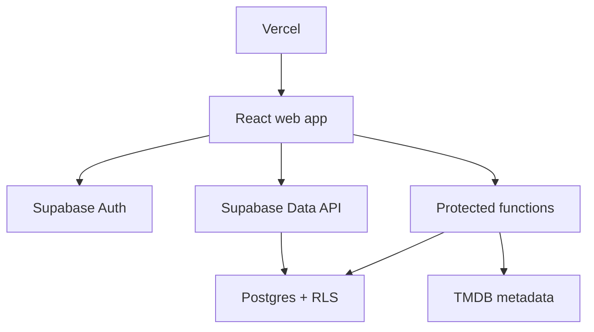

# Architecture

Doomsday Watch Group is a Vite SPA hosted on Vercel. Privileged writes go through Postgres functions and Row Level Security. The browser uses the Supabase publishable key only.



## Authorization

A signed-in user must not read or mutate any group-owned row unless they have an active membership in that group. Helper functions (`is_group_member`, `is_group_owner`, `current_user_is_membership`) back RLS. Group creation, invite redemption, and ownership transfer are atomic database functions.

## Client layout

```text
src/
  app/                 # router, providers, query client
  components/          # shared UI primitives
  features/
    auth/
    groups/
    invites/
    watchlist/
    progress/
    reviews/
    members/
    activity/
  layouts/
  pages/
  lib/                 # Supabase client, env parsing, utilities
  hooks/
  types/
  test/
supabase/
  migrations/
  seed.sql
public/
```

Keep database access in feature query/mutation modules. Generate TypeScript database types after each schema migration.

## Environment

Documented in `.env.example`:

- `VITE_APP_URL` — public origin
- `VITE_SUPABASE_URL` — project URL
- `VITE_SUPABASE_PUBLISHABLE_KEY` — anon/publishable key
- `TMDB_API_READ_TOKEN` — server/script only

## Hosting

- GitHub is the source of truth: https://github.com/NotSanti/doomsday-watch-group
- Vercel deploys `main` to production and pull requests to preview URLs.
- `vercel.json` rewrites unknown paths to `index.html` so React Router nested URLs work.
- Register local, preview, and production auth callback URLs in Supabase (Milestone 3 / 12).
