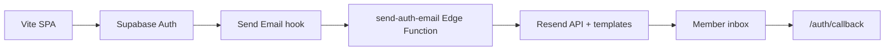

# Auth email (Resend API)

Doomsday Watch Group uses **Supabase Auth** for sign-up, email confirmation, and password reset. **Resend** sends every auth email through published **Resend templates**, triggered by a **Send Email** auth hook and the `send-auth-email` Edge Function.

The Vite app never sends auth mail and never ships a Resend API key. The browser calls `signUp` / `resetPasswordForEmail` with `emailRedirectTo` pointing at `/auth/callback`. GoTrue builds the verify token; the Edge Function renders the link into Resend template variables and sends.



## Local

Leave `[auth.hook.send_email]` disabled in `supabase/config.toml`. Confirmation and reset mail stay in Mailpit: `http://127.0.0.1:54324`.

To test Resend locally:

1. Create and publish templates in Resend (see below).
2. Copy `supabase/functions/.env.example` → `supabase/functions/.env` and fill in secrets.
3. Uncomment `[auth.hook.send_email]` in `supabase/config.toml`.
4. Run `supabase functions serve send-auth-email --no-verify-jwt` in one terminal and `supabase start` in another.
5. Sign up with a throwaway inbox and confirm the link lands on `{VITE_APP_URL}/auth/callback`.

## Resend templates

Create three published templates in the [Resend dashboard](https://resend.com/templates). Paste HTML from:

| Template | Subject | HTML source |
| --- | --- | --- |
| Confirm signup | `Confirm your Doomsday Watch Group account` | `docs/email-templates/confirm-signup.html` |
| Password reset | `Reset your Doomsday Watch Group password` | `docs/email-templates/password-reset.html` |
| Auth action (fallback) | `Doomsday Watch Group sign-in link` | Reuse confirm-signup HTML with a generic subject |

Each template needs these **Resend variables** (triple braces in HTML). Set a **fallback** on each in the Inspector so preview/test sends work:

| Variable | Type | Fallback (for preview) |
| --- | --- | --- |
| `ACTION_URL` | string | `https://doomwatchparty.online/auth/callback` |
| `USER_NAME` | string | `there` |

**Preview text** (Resend template field, separate from HTML): `One last step — confirm your email to join your watch group.`


Copy each template’s ID into the Edge Function secrets:

- `RESEND_TEMPLATE_CONFIRM_SIGNUP`
- `RESEND_TEMPLATE_PASSWORD_RESET`
- `RESEND_TEMPLATE_AUTH_ACTION` (magic link, invite, email change, etc.)

## Hosted Supabase (production)

1. Verify your sending domain in Resend (SPF + DKIM).
2. Create and **publish** the three templates above.
3. Deploy the Edge Function:

   ```bash
   supabase functions deploy send-auth-email --no-verify-jwt
   supabase secrets set --env-file supabase/functions/.env
   ```

4. Open [Auth Hooks](https://supabase.com/dashboard/project/mtnptgydaxcjycrrxyuz/auth/hooks) → **Send Email** → HTTPS.
5. URL: `https://<project-ref>.supabase.co/functions/v1/send-auth-email`
6. Generate a webhook secret and store it as `SEND_EMAIL_HOOK_SECRET` (`v1,whsec_…` format).
7. Leave custom SMTP off unless the Rate Limits page will not let you edit emails-per-hour (see below). The Send Email hook is what actually delivers mail.
8. Raise the Auth **emails per hour** limit (Resend does not do this for you).
9. Sign up with a throwaway inbox and confirm delivery + `/auth/callback` redirect.

`RESEND_*` and `SEND_EMAIL_HOOK_SECRET` are documented in `.env.example` as **names only**. Do not prefix them with `VITE_`. Do not add them to Vercel.

## Auth email rate limit (required)

`email rate limit exceeded` / `over_email_send_rate_limit` comes from **Supabase Auth**, not Resend. GoTrue still counts signup/reset emails project-wide. The built-in provider cap is **2 emails per hour**. Switching to Resend (SMTP or Send Email hook) only *unlocks* a higher cap; it does not raise it automatically.

1. Open [Authentication → Rate Limits](https://supabase.com/dashboard/project/mtnptgydaxcjycrrxyuz/auth/rate-limits).
2. Set **Rate limit for sending emails** to a value that matches testing/production (30 is the usual starting point after custom email; 100 is fine for a small fan app).
3. Save.

If that field is greyed out, either the Send Email hook is not enabled yet, or the dashboard still requires custom SMTP to be configured. In the SMTP-required case, enable Resend SMTP (`smtp.resend.com`, user `resend`, password = API key, sender = `noreply@doomwatchparty.online`) **and keep the hook enabled**. Auth will still send through the hook; SMTP is only there so the rate-limit setting can be changed.

Wait for the current hour window to reset if you already hit the 2-email cap, or raise the limit and retry.

## Redirect URLs

The client sends `emailRedirectTo` / `redirectTo` as `{VITE_APP_URL}/auth/callback`. The Send Email hook builds `ACTION_URL` as `{origin}/auth/callback?token_hash=…&type=…` (always the callback path, even when GoTrue’s `redirect_to` is only the Site URL `/`). The SPA calls `supabase.auth.verifyOtp` on `/auth/callback`. Do **not** link to `/auth/v1/verify` (the API gateway requires an `apikey` that email clients cannot send). If older emails still open `/` with `token_hash`, the public layout forwards them to `/auth/callback`.

## Legacy SMTP note

An older setup used Resend as Supabase SMTP transport with GoTrue HTML templates. That path is replaced by this hook + template flow. Do not configure both at once.
